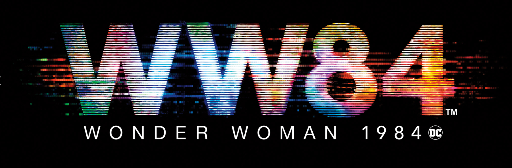

# **Super Quiz inspired by**
# **WONDER WOMAN 1984, coming to theaters**

## The (computer) science behind a personality quiz
Have you ever taken a personality quiz? You answer a series of multiple-choice questions and find out things like... "What type of emoji are you?"

Well, let’s help make a new personality quiz: ***Which WONDER WOMAN 1984 Character are you most like?***

*No prior background in computer science or Python is assumed.*

## Let's get started
Don’t worry. You won’t be making this personality quiz on your own. We’ll use the powers of Visual Studio Code and Python to build the quiz.

| Windows| Mac | Linux |
| :---: | :---: | :---: |
|  |  |  |
| [**Windows instructions**](quiz/setup_win.md) | [**Mac instructions**](quiz/setup_mac.md) | [**Linux instructions**](quiz/setup_linux.md) |

If you already have Visual Studio Code and Python set up then, you can skip ahead to the next step.

### [Skip setup >](quiz/basics.md)

